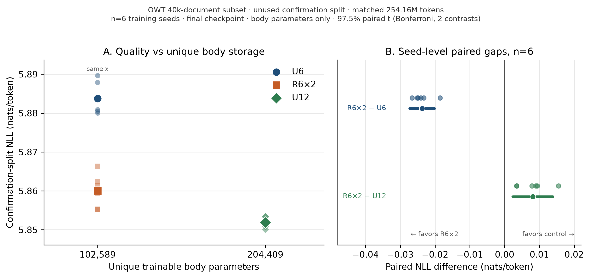

# rz1t

Recurrent-depth Z1T experiments under Extropic's sparse software constraints.

This repository accompanies the technical report
**[Recurrent Depth in Z1T: A Quality–Storage Trade-off](paper/main.tex)**.
It is a software study of unique body storage versus applied depth. It is **not**
a measurement of TSU energy, silicon area, latent reasoning, or a claim that
extra recurrence at inference helps an already-trained model.

Z1T source is vendored unmodified at
`13051e90df9669be5b8f9f34fb097329fa82f674` in [`upstream/`](upstream/)
([extropic-ai/sparse-transformers](https://github.com/extropic-ai/sparse-transformers)).

## Result (confirmation holdout, n=6)

Three models, same width / sparsity / tokenizer / training-token budget
(`254,164,992` presentations on an archived 40k-document OpenWebText subset):

| Arm | Unique blocks | Applied depth | Unique body params | Mean confirmation NLL |
|---|---:|---:|---:|---:|
| U6 | 6 | 6 | 102,589 | 5.8838 |
| R6×2 | 6 | 12 | 102,589 | 5.8600 |
| U12 | 12 | 12 | 204,409 | 5.8519 |

- Versus **U6** (same unique body): R6×2 is **2.35% lower perplexity**
  (mean NLL gap −0.0237; 97.5% paired interval [−0.0273, −0.0202]).
- Versus **U12** (same applied depth): R6×2 costs **0.81% perplexity** with
  **49.8% fewer unique body parameters**
  (mean gap +0.0081; interval [+0.0023, +0.0139]).

Primary figure:



Per-seed numbers, protocols, and limitations:
[`reference/claim-a-results.md`](reference/claim-a-results.md),
[`paper/main.tex`](paper/main.tex).

## Reproduce analysis (no GPU)

```bash
uv sync --frozen --python 3.12 --extra dev --extra prepare
JAX_PLATFORMS=cpu uv run pytest -q
JAX_PLATFORMS=cpu uv run python scripts/analyze_claim_a.py
JAX_PLATFORMS=cpu uv run python scripts/make_paper_figures.py
```

Checksummed metrics for the 18 confirmation runs are in
[`artifacts/claim-a/`](artifacts/claim-a/) (see [`artifacts/MANIFEST.json`](artifacts/MANIFEST.json)).
Full-state checkpoints (~400 MB each) are **not** in git.

## Train a smoke run

```bash
JAX_PLATFORMS=cpu uv run python -m rz1t.train \
  --config configs/dev/smoke.yaml --out results/my-smoke
```

Confirmation-split configs used in the paper live under
[`configs/claim-a/`](configs/claim-a/). They expect a locally prepared
OWT-subset manifest at `data/owt-subset-256/manifest.json`.

## Layout

| Path | Contents |
|---|---|
| `rz1t/` | Recurrent model, trainer, accounting, analysis |
| `upstream/` | Vendored Z1T snapshot |
| `configs/claim-a/` | 18 paper runs (seeds 7–12 × U6 / R6×2 / U12) |
| `artifacts/` | Checksummed metrics tarballs |
| `reference/paper-figures/` | Figures 1–5 |
| `paper/main.tex` | Technical report |
| `runpod/` | Optional GPU launch / archive helpers (dry-run by default) |

## What this is not

- Not full OpenWebText.
- Not a non-inferiority / H1 test at δ = 0.01.
- Not measured thermodynamic-sampling energy.
- Not affiliation with Extropic.

## License

Apache-2.0. See [`LICENSE`](LICENSE) and [`NOTICE`](NOTICE).
Upstream licensing is preserved under `upstream/`.
